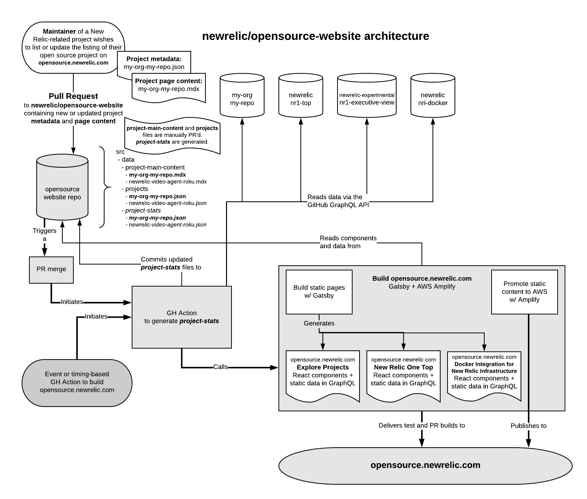

[](https://github.com/newrelic/open-source-office/blob/master/examples/categories/index.md#category-community-project)

# opensource-website

The `opensource-website` project is the code and data behind [opensource.newrelic.com](https://opensource.newrelic.com) generated by [Gatsby](https://www.gatsbyjs.org).

 [](https://snyk.io/test/github/newrelic/opensource-website)

## About

This project is made up of a few components:

- React code, components, and page templates built primarily in [MDX](https://mdxjs.com/)
- Static [data](https://github.com/newrelic/opensource-website/tree/master/src/data) for each open source project listed and promoted on the site, including:
  - `project metadata` in the data/projects directory
  - `project stats` in the data/project-stats directory
  - `markdown content` in the data/project-main-content directory
- Static pages promoting New Relic's engagement in open standards as well as highlighting specific features and collections in New Relic's open source capabilities
- Automation to handle:
  - updating of dynamic data in the `project stats` directory and in
  - building the static pages
  - deploying the site to a static hosting platform

### Architecture



## Contributing project data

Contributing new or updated project data to `opensource.newrelic.com` requires the following process.

1. `Fork` this repository.
2. Add/update the files below to your forked `opensource-website` repository.
3. Submit a `Pull Request` back to this project containing your new or updated files.
4. If/when your `PR` is accepted, the automation in this project will populate a related file in the `src/data/project-stats` directory, build the site, and deploy a new version of the code (including your project's data) to `opensource.newrelic.com`.

To add your project to `opensource.newrelic.com`, you must provide **the following two files**. To update the data on a given project, changes to one of these two files must be present for the `PR` to be accepted and merged.

### 1. Project metadata

This file contains the base information about the project detail pages as well as the project search/exploration page.

**File format:** `data/projects/[GITHUB_ORG_NAME]-[GITHUB_REPO_NAME].json`

**Example:** `data/projects/newrelic-nr1-github.json`

**Template:** `data/templates/projects.json`

### 2. Project metadata

This file contains the content (markdown and optional React components) that populates the left-hand column of a project detail page.

**File format:** `data/project-main-content/[GITHUB_ORG_NAME]-[GITHUB_REPO_NAME].mdx`

**Example:** `data/project-main-content/newrelic-nr1-github.mdx`

**Template:** `data/templates/project-main-content.mdx`

## Open source license

This project is distributed under the [Apache 2 license](LICENSE).

## Getting started

1. Ensure that you have [Git](https://git-scm.com/book/en/v2/Getting-Started-Installing-Git) and [NPM](https://www.npmjs.com/get-npm) installed. If you're unsure whether you have one or both of them installed, run the following commands. (If you have them installed, these commands return a version number; if not, the commands aren't recognized.)

```bash
git --version
npm -v
```

2. Execute the following command to clone this repository and run the code locally against your New Relic data:

```bash
npm install
npm start
```

Open [http://localhost:8000/](http://localhost:8000/) in your preferred, modern browser.

# Support

New Relic has open-sourced this project. This project is provided AS-IS WITHOUT WARRANTY OR DEDICATED SUPPORT. Issues and contributions should be reported to the project here on GitHub.

We encourage you to bring your experiences and questions to the [Explorers Hub](https://discuss.newrelic.com) where our community members collaborate on solutions and new ideas.

## Community

New Relic hosts and moderates an online forum where customers can interact with New Relic employees as well as other customers to get help and share best practices. Like all official New Relic open source projects, there's a related Community topic in the New Relic Explorers Hub. You can find this project's topic/threads here:

https://discuss.newrelic.com/t/opensource-website
*(Note: This URL is subject to change before GA)*

## Issues / enhancement requests

Issues and enhancement requests can be submitted in the [Issues tab of this repository](../../issues). Please search for and review the existing open issues before submitting a new issue.

# Contributing code

Contributions are encouraged! If you submit an enhancement request, we'll invite you to contribute the change yourself. Please review our [Contributors Guide](CONTRIBUTING.md).

Keep in mind that when you submit your pull request, you'll need to sign the CLA via the click-through using CLA-Assistant. If you'd like to execute our corporate CLA, or if you have any questions, please drop us an email at opensource+opensource-website@newrelic.com.