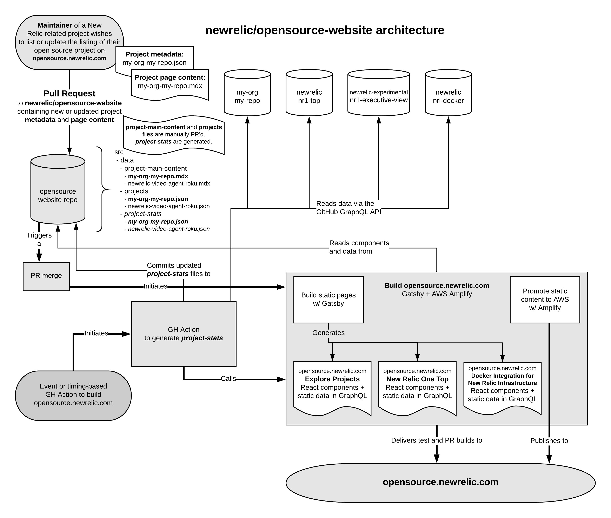

## Design Choice: Project stats automation commits will appear out of sync

Every few hours as based on [this configuration](https://github.com/newrelic/opensource-website/blob/develop/.github/workflows/project-stats.yml#L4), a GitHub Action executes some automation to rebuild the [stats content](https://github.com/newrelic/opensource-website/tree/develop/src/data/project-stats) of this site for each project in the [src/data/projects](https://github.com/newrelic/opensource-website/tree/develop/src/data/projects) directory.

[That automation](https://github.com/newrelic/opensource-website/tree/develop/.github/actions/sync-data) does a few things:

1. Retrieve the latest stats from GitHub for each [newrelic](https://github.com/newrelic) and [newrelic-experimental](https://github.com/newrelic-experimental) project registered in the [projects](https://github.com/newrelic/opensource-website/tree/develop/src/data/projects) directory using the GitHub v3 and v4 API's
2. Write that data to the [staging/develop branch](https://github.com/newrelic/opensource-website/tree/develop/)
3. Selectively write the [develop](https://github.com/newrelic/opensource-website/tree/develop/) commit to the [production/main branch](https://github.com/newrelic/opensource-website/tree/main)
4. Kick off builds to both the [staging](https://staging-opensource.newrelic.com) and [production](https://opensource.newrelic.com) environments **without** revisioning the sites

This was chosen so that functional changes in the [develop](https://github.com/newrelic/opensource-website/tree/develop/) branch could be tested, reviewed, and merged intentionally while automated content updates would be kept up-to-date in both branches.

The consequence of this choice is that the commit to the [develop](https://github.com/newrelic/opensource-website/tree/develop/) branch is not the same identifier as the commit to the [main](https://github.com/newrelic/opensource-website/tree/main) branch for precisely the same change. In the case of a PR, from [staging](https://github.com/newrelic/opensource-website/tree/develop/) to [production](https://github.com/newrelic/opensource-website/tree/main), the commit histories will appear (in those areas) out of sync, without generating a merge conflict.

Two commits for the same change isn't optimal, but it's the choice the original maintainers made. Feel free to criticize (and suggest a better solution) in an [issue](https://github.com/newrelic/opensource-website/issues).
